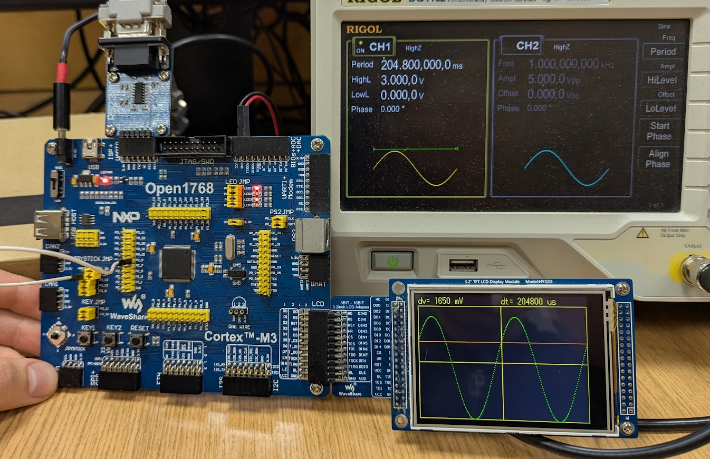

# Oscilloscope

## Overview
The code of my final project for an Embedded Systems (Systemy Wbudowane) course at AGH - a simple oscilloscope for the Open1768 board. It captures waveforms using the board's ADC and displays them on a 3.2" LCD screen. 

The oscilloscope has been tested and works reasonably well with periodic signals of frequencies ranging from around 1 Hz to a couple of kHz.

## Features
- Captures and visualizes signals from the in-built ADC
- Displays waveforms on a 3.2" LCD screen
- Adjustable voltage (`dv`) and time (`dt`) scales
- Edge-based trigger detection, with configurable trigger level
- UART output for logging

## Implementation Overview
The project is structured into multiple modules:
- **Buffer**: Manages signal data storage
- **LCDControl**: Handles graphical rendering on the LCD
- **Control**: Manages user input (joystick, buttons) and stores the application config
- **ADC**: Configures and manages ADC sampling, along with the very important ADC interrupt handler
- **Trigger**: Implements edge-based signal triggering
- **Main**: Initializes components and runs the main loop

The program is based on interrupts, with the main thread responsible only for drawing the traces (when the `do_draw` flag is set). The ADC interrupt handler (executed every 20 us, after the ADC has performed a measurement) keeps track of every n-th (depending on the `dt` setting) measurement and checks it for the trigger condition. If the condition occurs, the procedure starts filling a buffer with each consecutive sample collected, and then sets the `do_draw` flag. 

A more detailed description of the project can be found in the `sw-oscilloscope.pdf` file (in Polish).

